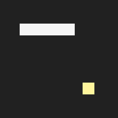

# Snake

This project implements two AI algorithms to play the game of [snake](https://en.wikipedia.org/wiki/Snake_(video_game_genre)):

| Algorithm | Example | Average Length* | Success Rate* |
| :-------: | :-----: | :-------------: | :-----------: |
|[Graph Search](#graph-search)||35.86|94%|
|[Reinforcement Learning](#reinforcement-learning)||29.33|50%|

\* **Average Length:** Average length of the snake before the game ends. The game ends when the snake hits itself or the wall, or consumes all the food and reaches the max length. The game grid is 6x6, so the max length is 36. The average is computed over 1000 rounds.

\* **Success Rate:** Success means the snake is able to consume all the food and reach the max length without hitting itself or the wall. The rate is computed over 1000 rounds.

## Installation

The project requires Python >= 3.10. Create a virtual environment first:

```
python3 -m venv venv
source venv/bin/activate
```

Install mandatory dependencies:

```
pip3 install -r requirements.txt
```

Play the game with graph search (append `-h` to see all supported options):

```
python3 main.py
```

**Optional:** To play the game with reinforcement learning or train the reinforcement learning model, please install [PyTorch](https://pytorch.org/get-started/locally/) based on your CPU/GPU preference. The program supports both CPU and GPU. Run the command below to play the game with reinforcement learning:

```
python3 main.py -m rl
```

The pre-trained reinforcement learning model is available [here](./rl_model.pt). Run the command below to train your own model:

```
python3 rl_train.py
```

## Algorithms

Two algorithms are implemented to play the game. The first algorithm is based on graph search, providing a rule-based strategy for different situations. The second algorithm is based on reinforcement learning, where the snake learns to play the game by trial and error without prior knowledge.

### Graph Search

The algorithm models the grid as a graph where nodes are positions and edges connect adjacent positions (up, down, left, right). The algorithm decides the next move using the strategy below:

1. If the snake is long enough, the algorithm searches for a [Hamiltonian path](#hamiltonian-path) from the snake's head to its tail. If the path exists, the snake can safely move along a Hamiltonian cycle to reach the max length. Otherwise, go to the next step.

2. The algorithm searches for the shortest path from the snake's head to the food. If the path exists, it temporarily moves the snake along the path to eat the food and checks whether there's a safe path from the snake's head to its tail afterwards. If so, it means the snake can safely eat the food without getting trapped, so it can follow the shortest path to the food. Otherwise, go to the next step.

3. At this point, the snake cannot safely eat the food. The algorithm searches for a [longer path](#longer-path) from the snake's head to its tail to rearrange the grid, hopefully creating a safe path to the food later. If the path to the tail exists, the snake can move along the path. Otherwise, go to the next step.

4. At this point, the snake can neither safely eat the food nor move towards its tail. The algorithm examines the reachable neighboring positions of the snake's head, and moves the snake towards the position farthest from the food, aiming to move away from the food and hopefully free up space to create a safe path in the future.

The algorithm is implemented [here](./src/agents/graph.py#L27).

#### Hamiltonian Path

A [Hamiltonian path](https://en.wikipedia.org/wiki/Hamiltonian_path) is a path in a graph that visits each vertex exactly once. A Hamiltonian cycle is a Hamiltonian path that is a cycle, meaning it starts and ends at the same vertex. In the game of snake, following a Hamiltonian cycle guarantees the snake visits every position without getting trapped, and hence can safely consume all the food and reach the max length.

Finding a Hamiltonian path is an NP-complete problem. However, for a small 6x6 grid, with backtracking and [Warnsdorf's heuristic](https://en.wikipedia.org/wiki/Knight's_tour#Warnsdorf's_rule) to guide the search, it is possible to find a Hamiltonian path in a reasonable time. The algorithm only searches for a Hamiltonian path when the snake is long enough to increase the likelihood of finding one quickly.

#### Longer path

A longer path is a path that might be slightly longer than the shortest path. It is constructed by inserting perpendicular side-steps along each path segment. For example, if the snake needs to move right, the longer path replaces that step with a three-step detour (down -> right -> up), creating a zig-zag pattern.

The reason to use a longer path instead of the shortest path is to handle the case where the snake's head is adjacent to its tail. This usually happens when the snake grows long enough. If the snake moves along the shortest path, it will arrive at the tail in the next step. While the game allows the snake to move into the tail's position (because the tail moves away when the head moves forward), this can cause the snake to indefinitely move along a fixed path. By using a longer path, the snake fills empty positions near its tail before arriving, freeing space for future moves.

### Reinforcement Learning

[Reinforcement learning](https://en.wikipedia.org/wiki/Reinforcement_learning) is a machine learning paradigm where an agent learns to make decisions by taking actions in an environment to maximize cumulative rewards. In this game, the snake is the agent, the game grid is the environment, and the actions are the possible moves. The learning algorithm uses a neural network to approximate the action-value function, which estimates the expected cumulative reward for taking a certain action in a given state. The snake learns to play the game by exploring different actions and receiving rewards based on the outcomes (e.g., positive reward for eating food, negative reward for hitting itself or the wall). Using neural networks in reinforcement learning is known as [deep reinforcement learning](https://en.wikipedia.org/wiki/Deep_reinforcement_learning). For better convergence and stability, the training process applies the [Double DQN](https://arxiv.org/abs/1509.06461) technique.

Implementation: [Network Structure](./src/agents/rl.py#L51) | [Inference](./src/agents/rl.py#L148) | [Training](./rl_train.py)

#### State Representation

The snake's current state is represented as two tensors concatenated together:

1. The first tensor is a 4-channel 6x6 tensor that is fed into convolutional layers. The 4 channels encode 1) the food position, 2) the snake's body, 3) the snake's head, and 4) the danger positions (where the game ends if the snake moves to these positions).

2. The second tensor is a 1D tensor which includes 1) the snake's current moving direction, 2) the current direction of the food relative to the snake's head, and 3) the Manhattan distance between the snake's head and the food.

The output from the convolutional layers and the second tensor are concatenated and fed into a few fully connected layers towards the output layer, which produces the Q-values for each possible action in the current state.

#### Action Space

Because the game doesn't allow the snake to move in the opposite direction, the action space is defined as three actions: turn left, turn right, and go straight, relative to the snake's current moving direction. Therefore, the output layer of the neural network has three output units, each representing the Q-value for one of the three actions.

#### Reward Design

The rewards that the agent receives when interacting with the environment are crucial to training an effective agent. In this game, the reward function is designed as follows:

1. If the snake hits itself or the wall, it receives a large negative reward of `-100`.

2. If the snake eats one piece of food, it receives a positive reward of `+10`.

3. If the snake reaches the max length, it receives a large positive reward of `+100`.

4. If the snake is still alive but doesn't eat any food, it receives a small negative reward of `-0.01`. This is to encourage the snake to find the food and finish the game faster. The negative reward is small, because the snake might need to take some detours to avoid getting trapped, and we don't want to discourage that behavior.

5. If the snake moves for a certain number of steps without eating any food, it receives a large negative reward of `-100` and the game ends. This is to prevent the snake from moving around indefinitely without making progress.

## License

See the [LICENSE](./LICENSE) file for license rights and limitations.
